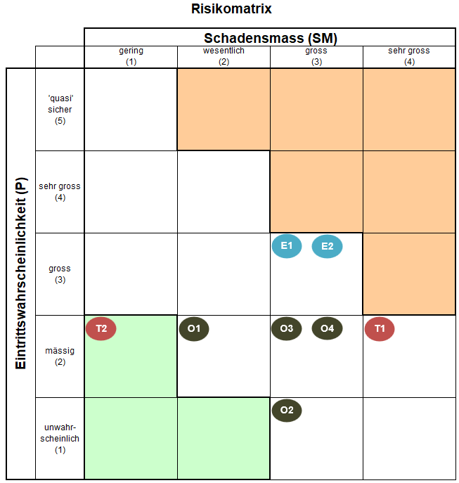

# Risikomanagement-Bericht – My-Histo-App
**Autoren:** **Sivakumar Sivanajani**  
**Datum:** 27.02.2025 

# Inhaltsverzeichnis

- [1. Einleitung](#1-einleitung)
- [2. Ziel des Risikomanagements](#2-ziel-des-risikomanagements)
- [3. Risikoidentifikation und deren Auswirkungen](#3-risikoidentifikation-und-deren-auswirkungen)
  - [3.1 Technische Risiken](#31-technische-risiken)
  - [3.2 Organisatorische Risiken](#32-organisatorische-risiken)
  - [3.3 Externe Risiken](#33-externe-risiken)
- [4. Risikomatrix und deren Bedeutung](#4-risikomatrix-und-deren-bedeutung)
  - [4.1 Erklärung der Matrix](#41-erklärung-der-matrix)
    - [4.1.1 Bedeutung der Farbmarkierungen](#411-bedeutung-der-farbmarkierungen)
  - [4.2 Risikomatrix](#42-risikomatrix)
- [5. Risikominderungsmassnahmen](#5-risikominderungsmassnahmen)
  - [5.1 Technische Massnahmen](#51-technische-massnahmen)
  - [5.2 Organisatorische Massnahmen](#52-organisatorische-massnahmen)
  - [5.3 Massnahmen für externe Risiken](#53-massnahmen-für-externe-risiken)

## 1. Einleitung

Dieser Bericht beschreibt die wesentlichen Risiken im Rahmen des My-Histo-App-Projekts und legt Massnahmen fest, um diese Risiken zu minimieren. Ziel ist es, den Projekterfolg zu sichern, indem potenzielle Probleme frühzeitig erkannt und aktiv gemanagt werden.

## 2. Ziel des Risikomanagements

- **Frühzeitige Risikoerkennung**, um Verzögerungen oder Fehlentwicklungen zu vermeiden.
- **Spezifische Risikobewertung**, um gezielte Massnahmen zu entwickeln.
- **Regelmässiges Monitoring**, um die Wirksamkeit der Massnahmen sicherzustellen.

## 3. Risikoidentifikation und deren Auswirkungen

### 3.1 Technische Risiken

| ID  | Risiko | Beschreibung | Mögliche Auswirkungen |
|-----|--------|-------------|-----------------------|
| T1  | **PACS-Integration schlägt fehl** | Probleme bei der Implementierung des WADO-URI-Zugriffs auf das PACS-System. | Keine Bildabrufe möglich, Kernfunktionalität der App nicht nutzbar. |
| T2  | **Unzureichende Fehlerbehandlung und Ausnahmehandling** | Fehler oder unerwartete Situationen werden nicht richtig abgefangen. | Systemabstürze, unverständliche Fehlermeldungen oder Sicherheitsrisiken. |

### 3.2 Organisatorische Risiken

| ID  | Risiko | Beschreibung | Mögliche Auswirkungen |
|-----|--------|-------------|-----------------------|
| O1  | **Krankheit oder Ausfall von Teammitgliedern** | Ein Teammitglied fällt unerwartet für längere Zeit aus. | Verzögerungen in der Entwicklung, fehlendes Wissen über bestimmte Komponenten. |
| O2  | **Schlechte Kommunikation innerhalb des Teams** | Unklare Abstimmung, fehlende Transparenz über Fortschritte oder Blockaden. | Missverständnisse, doppelte Arbeit, ineffiziente Problemlösung. |
| O3  | **Fehlende Motivation oder Teamkonflikte** | Spannungen oder Unzufriedenheit im Team führen zu geringerer Produktivität. | Verzögerungen, reduzierte Arbeitsqualität, negative Auswirkungen auf die Zusammenarbeit. |
| O4  | **Schlechte Sprint- oder Zeitplanung** | Entwicklungsaufgaben sind zu ambitioniert geplant, Pufferzeiten fehlen oder gesetzliche Feiertage (z. B. Fasnacht) werden nicht berücksichtigt. | Projektverzögerungen, unzureichende Qualität, hoher Stress im Team. |

### 3.3 Externe Risiken

| ID  | Risiko | Beschreibung | Mögliche Auswirkungen |
|-----|--------|-------------|-----------------------|
| E1  | **Fehlende oder verspätete Bereitstellung der Farbanalyse-Daten** | Das Data Science Team liefert die analysierten Farbmerkmale der histologischen Bilder nicht rechtzeitig. | Verzögerung bei der Entwicklung der Farbfilter-Funktion, unvollständige Features in der finalen Version. |
| E2  | **Geplante oder unerwartete GitLab-Updates/Wartungsarbeiten** | Während eines Updates oder einer Wartung kann GitLab nicht genutzt werden, wodurch Commits, CI/CD-Pipelines oder Issue-Tracking vorübergehend ausfallen. | Entwicklungsverzögerungen, keine automatischen Tests oder Builds möglich, Kommunikationsprobleme im Team. |

## 4. Risikomatrix und deren Bedeutung

Die Risikobewertung erfolgt anhand einer **farbcodierten Matrix**, die das Verhältnis zwischen der **Eintrittswahrscheinlichkeit (P)** und dem **Schadensmass (SM)** darstellt. Diese Matrix ermöglicht eine strukturierte Einschätzung der Risiken im Projekt.

> **Hinweis:** Die hier verwendete Risikomatrix wurde angepasst nach dem Modell des **Schweizerischen Bundesarchivs**. Weitere Informationen und die Originalversion sind unter folgendem Link abrufbar:  
> [Risikobewertung nach Schweizerischem Bundesarchiv](https://www.bar.admin.ch/dam/bar/de/dokumente/kundeninformation/risiko-cockpit.xls.download.xls/risiko-cockpit.xls).

### 4.1 Erklärung der Matrix
Die Matrix setzt sich aus zwei Hauptdimensionen zusammen:

1. **Eintrittswahrscheinlichkeit (P):**  
   Diese Achse beschreibt, wie wahrscheinlich das Eintreten eines bestimmten Risikos ist. Sie wird in fünf Stufen unterteilt:  
   - *Unwahrscheinlich (1)* – Das Risiko tritt nur in Ausnahmefällen auf.  
   - *Mässig (2)* – Das Risiko könnte auftreten, ist aber nicht sehr wahrscheinlich.  
   - *Gross (3)* – Das Risiko wird mit hoher Wahrscheinlichkeit eintreten.  
   - *Sehr gross (4)* – Das Risiko wird mit hoher Wahrscheinlichkeit mehrmals auftreten.  
   - *"Quasi sicher" (5)* – Das Risiko wird mit nahezu 100 % Sicherheit eintreten.  

2. **Schadensmass (SM):**  
   Diese Achse beschreibt die Auswirkungen, die ein Risiko auf das Projekt haben kann, falls es eintritt. Sie wird in vier Stufen eingeteilt:  
   - *Gering (1)* – Kaum spürbare Auswirkungen auf das Projekt.  
   - *Wesentlich (2)* – Mässige Beeinträchtigung, aber noch im vertretbaren Rahmen.  
   - *Gross (3)* – Starke Beeinträchtigung mit erheblichen Folgen für den Projektverlauf.  
   - *Sehr gross (4)* – Kritische Auswirkungen, die das Projekt gefährden oder zum Scheitern bringen können.  

#### 4.1.1 Bedeutung der Farbmarkierungen
**🟢 Grün (akzeptabel):** Risiken in diesem Bereich sind als unkritisch einzustufen. Es sind keine wesentlichen Massnahmen erforderlich, jedoch sollte das Risiko im Blick behalten werden.  
**⚪ Weiss (bewusstseinsfördernd):** Diese Risiken sind nicht akut bedrohlich, aber es ist ratsam, sich frühzeitig mögliche Alternativlösungen zu überlegen.  
**🟠 Orange (bedingt akzeptabel-nicht akzeptabel):** Risiken in diesem Bereich erfordern eine gezielte Strategie zur Schadensbegrenzung und Risikominderung.  

### 4.2 Risikomatrix 
Im Folgenden wird die Risikomatrix dargestellt:

| Risiko ID | Risiko |
|-----------|-------------------------------|
| 🔴 **T1** | PACS-Integration schlägt fehl |
| 🔴 **T2** | Unzureichende Fehlerbehandlung und Ausnahmehandling         |
| 🟤 **O1** | Krankheit oder Ausfall von Teammitgliedern |
| 🟤 **O2** | Schlechte Kommunikation       |
| 🟤 **O3** | Fehlende Motivation oder Teamkonflikte |
| 🟤 **O4** | Schlechte Zeitplanung         |
| 🔵 **E1** | Verzögerte Farbanalyse-Daten  |
| 🔵 **E2** | GitLab-Updates/Wartungsarbeiten |

## 5. Risikominderungsmassnahmen

### 5.1 Technische Massnahmen
- **T1:** Entwicklung eines Prototyps für PACS-Anbindung **vor Sprint 2 (vor dem  Go/No-Go)** zur frühzeitigen Validierung.  
- **T2:** Einheitliche Fehlerbehandlung mit Logging und benutzerfreundlichen Fehlermeldungen implementieren.  

### 5.2 Organisatorische Massnahmen
- **O1:** Regelmässige Wissensweitergabe zwischen Teammitgliedern durch Pair Programming und Dokumentation, um Know-how-Verlust zu vermeiden.    
- **O2:** Tägliche Abstimmung im Team über Chat, sowie zwei wöchentliche Meetings (Montag und Donnerstag), um Fortschritt und Probleme frühzeitig zu erkennen.  
- **O3:** Offene Feedback-Kultur etablieren, um Konflikte proaktiv zu lösen.  
- **O4:** Agile Sprint-Planung mit realistischen Deadlines und Pufferzeiten, wobei ein iterativer Loop-Ansatz verfolgt wird, um kontinuierliche Anpassungen und Optimierungen zu ermöglichen.

### 5.3 Massnahmen für externe Risiken
- **E1:** Frühzeitige Anfrage und regelmässige Abstimmung mit dem Data Science Team, um Verzögerungen zu vermeiden.  
- **E2:** GitLab-Wartungsplan regelmässig prüfen und Updates einplanen ([GitLab Maintenance Policy](https://docs.gitlab.com/policy/maintenance/)).