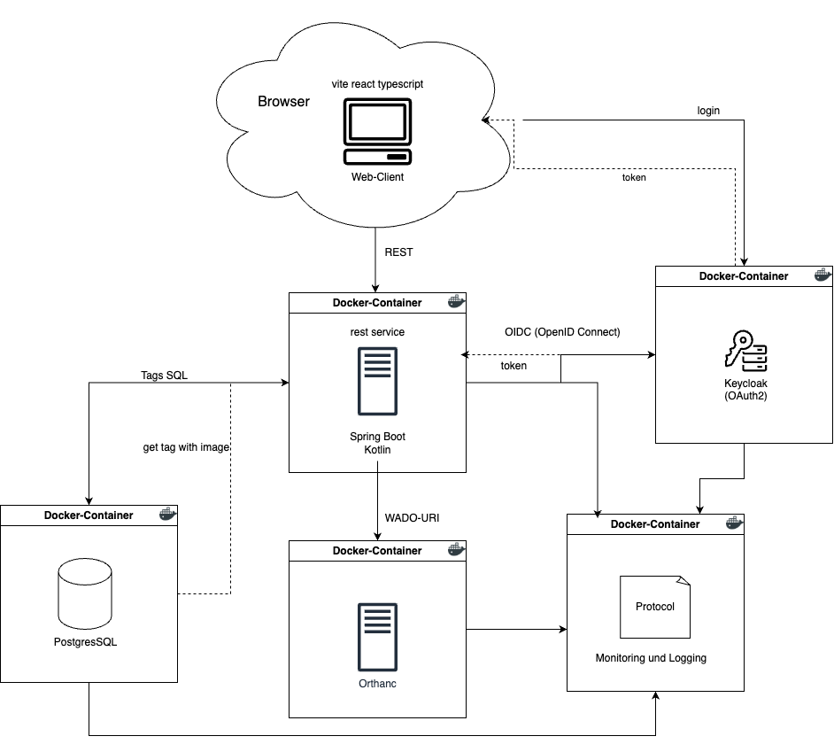
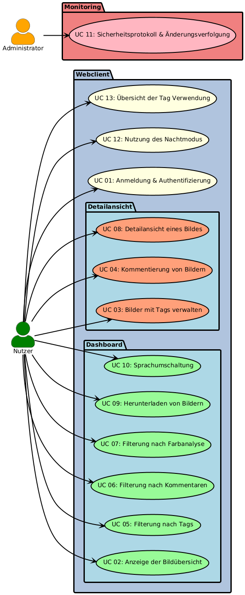
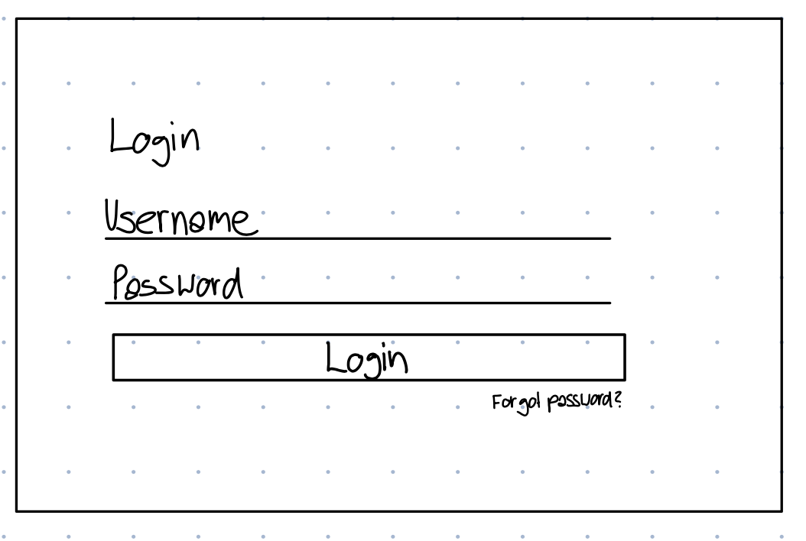
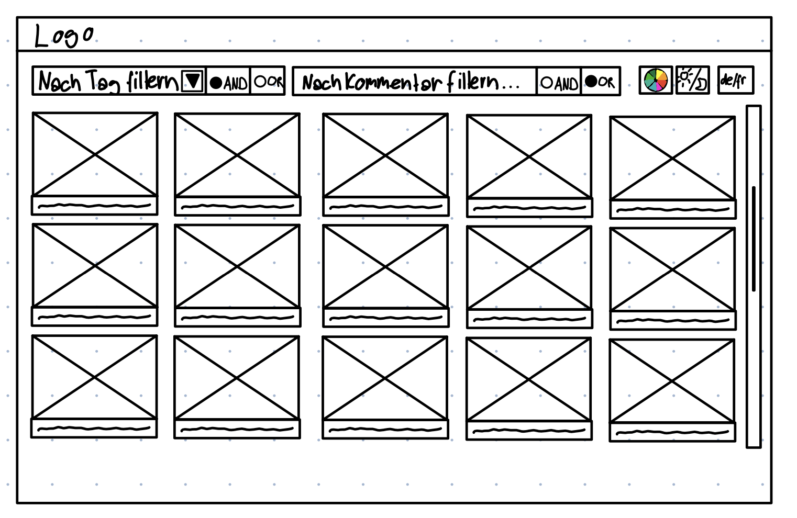
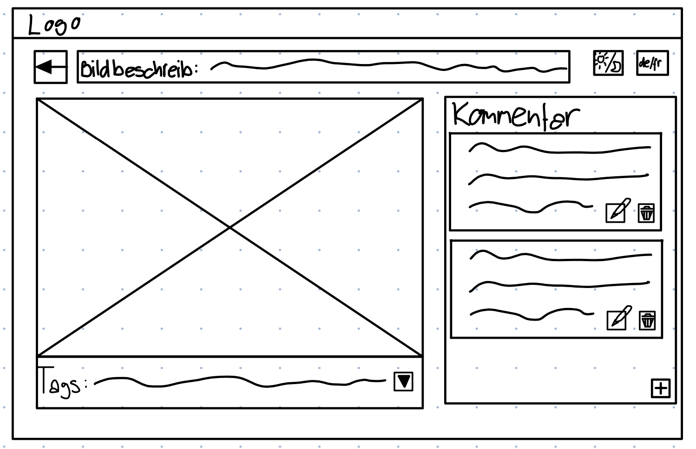
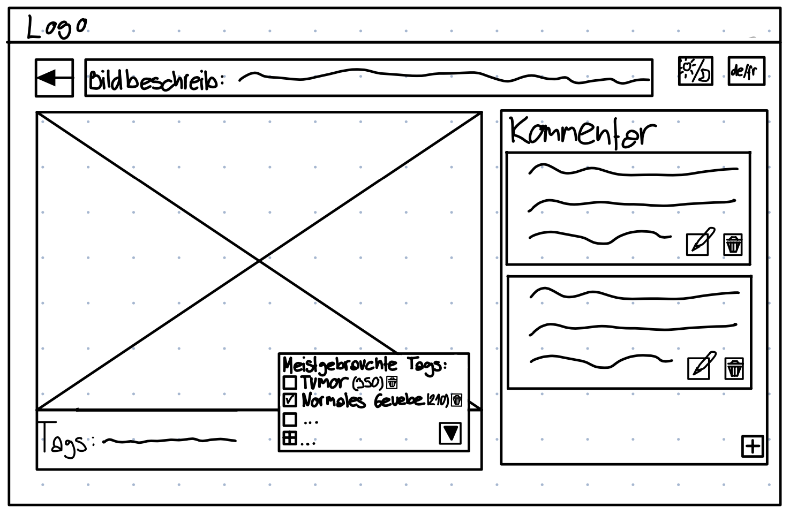

# Software Requirements Specification

**Web-Applikation My-Histo-App**  
**Software Requirements Specification**  
**Version:** 1  
**Datum:** 28.02.2025

**Erstellt für:**  
B-LS-MI 003 Medizininformatik Projekt  
Dominique Brodbeck, Markus Degen, Ronald Tanner

## Änderungshistorie

| Datum     | Version |Autor*innen                   | Beschreibung             |
| -------- | ----------- |------------------------ | -------------------- |
| 17.02.25 | Version 0.1 | Sivanajani Sivakumar | Dokument erstellt. |
| 19.02.25 | Version 0.2 | Sivanajani Sivakumar | SRS wurde überarbeitet und gekürzt, um den Fokus auf die wesentlichen Anforderungen zu legen. |
| 23.02.25| Version 0.3 | Sivanajani Sivakumar | Überarbeitung und Erweiterung der Use Cases.|
| 26.02.25| Version 0.4 | Sivanajani Sivakumar | Anpassung der Use Cases und des Inhaltsverzeichnisse sowie einfügen des UseCase Diagramms.|
| 27.02.25| Version 0.5 | Sivanajani Sivakumar | Verbesserungen der Use Cases.|
| 28.02.25| Version 0.6 | Sivanajani Sivakumar | Software- und Kommunikationsschnittstellen Kaptiel angepasst und Architektur eingefügt.|
| 28.02.25| Version 1 | Damaris Mettler, Mërgime Rama, Reto Sutter, Sivanajani Sivakumar | Autoren akzeptieren und genehmigen das SRS-Dokument mittels Kürzel.|

## Genehmigung des Dokuments
Die folgende Software-Anforderungsspezifikation wurde von den folgenden Personen akzeptiert und genehmigt:

| **Kürzel** | **Printed Name**           | **Date**  |
|------------|----------------------------|-----------|
|    MR      | Mërgime Rama               | 28.02.25  |
|    RS      | Reto Sutter                | 28.2.25   |
|    DM      | Damaris Mettler            | 28.2.25   |
|    SS      | Sivanajani Sivakumar       | 28.02.25  |

# Inhaltsverzeichnis

- [1. Einleitung](#1-einleitung)
  - [1.1 Zweck des Dokuments](#11-zweck-des-dokuments)
  - [1.2 Softwareprodukt Umfang](#12-softwareprodukt-umfang)
  - [1.3 Definitionen, Akronyme und Abkürzungen](#13-definitionen-akronyme-und-abkürzungen)
  - [1.4 Referenzen](#14-referenzen)
  - [1.5 Überblick vom SRS](#15-überblick-vom-srs)
- [2. Gesamtbeschreibung](#2-gesamtbeschreibung)
  - [2.1 Produktübersicht](#21-produktübersicht)
  - [2.2 Produktfunktionen (Kernfunktionen)](#22-produktfunktionen-kernfunktionen)
    - [2.2.1 Use Case Übersicht](#221-use-case-übersicht)
  - [2.3 Benutzermerkmale](#23-benutzermerkmale)
  - [2.4 Allgemeine Einschränkungen](#24-allgemeine-einschränkungen)
  - [2.5 Annahmen und Abhängigkeiten](#25-annahmen-und-abhängigkeiten)
- [3. Spezifische Anforderungen](#3-spezifische-anforderungen)
  - [3.1 Anforderungen an externe Schnittstellen](#31-anforderungen-an-externe-schnittstellen)
    - [3.1.1 Benutzeroberfläche](#311-benutzeroberfläche)
    - [3.1.2 Hardware-Schnittstellen](#312-hardware-schnittstellen)
    - [3.1.3 Software- und Kommunikationsschnittstellen](#313-software--und-kommunikationsschnittstellen)
  - [3.2 Use Cases](#32-use-cases)
    - [3.2.1 UC-01: Anmeldung und Authentifizierung](#321-uc-01-anmeldung-und-authentifizierung)
    - [3.2.2 UC-02: Anzeige der Bildübersicht](#322-uc-02-anzeige-der-bildübersicht)
    - [3.2.3 UC-03: Bilder mit Tags versehen, bearbeiten oder entfernen](#323-uc-03-bilder-mit-tags-versehen-bearbeiten-oder-entfernen)
    - [3.2.4 UC-04: Kommentierung von Bildern](#324-uc-04-kommentierung-von-bildern)
    - [3.2.5 UC-05: Filterung nach Tags](#325-uc-05-filterung-nach-tags)
    - [3.2.6 UC-06: Filterung nach Kommentaren](#326-uc-06-filterung-nach-kommentaren)
    - [3.2.7 UC-07: Filterung nach Farbanalyse](#327-uc-07-filterung-nach-farbanalyse)
    - [3.2.8 UC-08: Detailansicht eines Bildes](#328-uc-08-detailansicht-eines-bildes)
    - [3.2.9 UC-09: Herunterladen von Histologiebildern](#329-uc-09-herunterladen-von-histologiebildern)
    - [3.2.10 UC-10: Sprachumschaltung](#3210-uc-10-sprachumschaltung)
    - [3.2.11 UC-11: Sicherheitsprotokoll und Änderungsverfolgung](#3211-uc-11-sicherheitsprotokoll-und-änderungsverfolgung)
    - [3.2.12 UC-12: Nutzung des Tagmodus und Nachtmodus](#3212-uc-12-nutzung-des-tagmodus-und-nachtmodus)
    - [3.2.13 UC-13: Übersicht der Tag-Verwendung](#3213-uc-13-übersicht-der-tag-verwendung)
  - [3.3 Nicht-funktionale Anforderungen](#33-nicht-funktionale-anforderungen)
    - [3.3.1 Verlässlichkeit](#331-verlässlichkeit)
    - [3.3.2 Verfügbarkeit](#332-verfügbarkeit)
    - [3.3.3 Sicherheit](#333-sicherheit)
  - [3.4 Inverse Requirements](#34-inverse-requirements)
  - [3.5 Design and Implementation](#35-design-and-implementation)
    - [3.5.1 Design](#351-design)
    - [3.5.2 Installation](#352-installation)
    - [3.5.3 Verteilung](#353-verteilung)
  - [3.6 Anforderungen an die logische Datenbank](#36-anforderungen-an-die-logische-datenbank)

## 1. Einleitung
Die effiziente Verwaltung und der unkomplizierte Zugriff auf Patientendaten sind von zentraler Bedeutung für die medizinische Forschung. Ein optimiertes Datenmanagement trägt massgeblich zur Beschleunigung wissenschaftlicher Erkenntnisse und zur kontinuierlichen Verbesserung der Patientenversorgung bei. Insbesondere in der Histologie, in der Gewebeproben eine essenzielle Rolle bei der Erforschung und Diagnose von Erkrankungen spielen, ist ein leistungsfähiges und strukturiertes System zur Speicherung, Organisation und Bereitstellung dieser Daten unerlässlich.

### 1.1 Zweck des Dokuments

Dieses Dokument stellt eine umfassende Informationsquelle für Entwickler, Wissenschaftler und Systemadministratoren dar. Es definiert die funktionalen und nicht-funktionalen Anforderungen an das Endprodukt und dient als zentrale Referenz für Planung, Implementierung und Wartung der Softwarelösung. Konkret beschreibt es die Anforderungen an ein Informationssystem zur Verwaltung von Histologie-Gewebeproben, das für Forschungszwecke genutzt wird und einen schnellen sowie einfachen Zugriff auf Patientendaten, Bilddaten und Metainformationen ermöglicht.

### 1.2 Softwareprodukt Umfang

Das Softwareprodukt ist eine webbasierte Anwendung zur Verwaltung und Organisation von Histologie-Gewebeproben. Sie ermöglicht Forschenden und medizinischem Fachpersonal einen effizienten Zugriff auf Bilddaten und deren zugehörige Metadaten und unterstützt eine strukturierte Verwaltung durch Annotationen und Tagging. Die Anwendung wird vorrangig in medizinischen Forschungseinrichtungen und Kliniken eingesetzt, um diagnostische und wissenschaftliche Prozesse zu optimieren. Zu den Hauptfunktionen zählen:

- Bereitstellung einer Web-Applikation zur Anzeige, Verwaltung und Kommentierung von Gewebeprobenbildern.
- Einsatz einer Microservices-Architektur mit PACS-Integration zur Bildspeicherung.
- Implementierung einer sicheren Authentifizierung und Autorisierung über Keycloak (OIDC).
- Bereitstellung eines Tagging-Systems zur Organisation und Suche von Bildern.
- Durchführung einer Farb-Analyse zur erweiterten Bildauswertung.
- Nutzung von Continuous Integration und Quality Assurance über GitLab CI/CD.

### 1.3 Definitionen, Akronyme und Abkürzungen

| Begriff/Abkürzung | Bedeutung |
| ----------------- | --------- |
| Annotationen      | Notizen oder Markierungen in Bilddaten zur Hervorhebung bestimmter Bereiche. |
| CI/CD             | Continuous Integration / Continuous Deployment – Automatisierung von Softwareentwicklung, Tests und Bereitstellung. |
| DICOM             | Digital Imaging and Communications in Medicine – Standard zur Speicherung und Übertragung medizinischer Bilddaten. |
| Docker            | Containerisierungsplattform zur Bereitstellung und Verwaltung von Anwendungen. |
| GitLab CI/CD      | Plattform zur Automatisierung von Build-, Test- und Deployment-Prozessen. |
| Histologie        | Die Lehre von den Geweben des Körpers auf mikroskopischer Ebene. |
| IEEE              | Institute of Electrical and Electronics Engineers – Organisation für technische Standards. |
| Keycloak          | Open-Source-Identitäts- und Zugriffsverwaltungssystem für Single Sign-On (SSO) und OIDC-basierte Authentifizierung. |
| Metadaten         | Zusätzliche Informationen zu Bilddaten (z.B. Erfassungsdatum, Quelle, Bildbeschreibung). |
| Microservices     | Architektur, bei der Anwendungen aus kleinen, unabhängigen Diensten bestehen. |
| OIDC              | OpenID Connect – Authentifizierungsprotokoll basierend auf OAuth 2.0. |
| PACS              | Picture Archiving and Communication System – System zur Speicherung und Verwaltung medizinischer Bilddaten. |
| REST API          | Representational State Transfer Application Programming Interface – Schnittstelle für Datenaustausch via HTTP. |
| Spring Boot       | Framework zur Entwicklung von Microservices und Spring-basierten Anwendungen. |
| Tagging           | Methode zur Kategorisierung und schnellen Suche von Daten mittels Schlagwörtern. |
| WADO-URI          | Web Access to DICOM Persistent Objects – Protokoll für den webbasierten Zugriff auf DICOM-Bilddaten. |

### 1.4 Referenzen

| Titel | Quellen | Letzte Aktualisierung | Autor | Nutzung | Letzter Zugriff |
| ----- | ------- | ---------------------- | ----- | ------- | --------------- |
| B-LS-MI 003 Medizininformatik Projekt | [b-ls-mi-sip.pages.fhnw.ch/sip-docs/](https://b-ls-mi-sip.pages.fhnw.ch/sip-docs/#das-projekt) | Februar 2025 | Dominique Brodbeck, Markus Degen, Ronald Tanner | Offizielle Projektanforderungen | 28.Februar 2025 |
| DICOM Standard | [dicomstandard.org](https://www.dicomstandard.org/about-home) | N/A | NEMA | Standard für Bilddatenübertragung | 28.Februar 2025 |
| Docker & Containerisierung | [docker.com](https://www.docker.com/) | N/A | Docker Inc. | Bereitstellung von Microservices | 28.Februar 2025 |
| GitLab CI/CD | [docs.gitlab.com/ci/](https://docs.gitlab.com/ci/) | N/A | GitLab | Automatisierung von Build, Test und Deployment | 28.Februar 2025 |
| Histologie – Grundlagen | [flexikon.doccheck.com/de/Histologie](https://flexikon.doccheck.com/de/Histologie) | 25.März 2024 | Dr. Frank Antwerpes | Definition und Grundlagen der Histologie | 28.Februar 2025 |
| IEEE SRS Guidelines | [ieee.org](https://www.ieee.org/) | N/A | IEEE | Leitlinien für SRS-Dokumentation | 28.Februar 2025 |
| Kotlin | [kotlinlang.org](https://kotlinlang.org/) | N/A | JetBrains | Programmiersprache für das Backend | 28.Februar 2025 |
| OpenID Connect (OIDC) | [keycloak.org](https://www.keycloak.org/) | N/A | Keycloak Team | Benutzer-Authentifizierung und Zugriffskontrolle | 28.Februar 2025 |
| OWASP Top 10 | [owasp.org](https://owasp.org/www-project-top-ten/) | N/A | OWASP | Grundlage für Sicherheitsanforderungen | 28.Februar 2025 |
| Spring Boot | [spring.io/projects/spring-boot](https://spring.io/projects/spring-boot) | N/A | Spring Framework Team | Entwicklung einer skalierbaren Microservices-Architektur | 28.Februar 2025 |

### 1.5 Überblick vom SRS

Dieses Dokument orientiert sich an den Richtlinien des IEEE Guide to Software Requirements Specifications (SRS) und bildet die zentrale Grundlage für die Spezifikation der Softwareanforderungen.  
- **Kapitel 2** definiert die Zielsetzung des Systems, erläutert dessen Hauptfunktionen und analysiert die massgeblichen Benutzergruppen unter Berücksichtigung der Anforderungen der Stakeholder.  
- **Kapitel 3** beschreibt die funktionalen und nicht-funktionalen Anforderungen sowie die technischen Rahmenbedingungen für die Implementierung und Umsetzung der Systemfunktionen.

## 2. Gesamtbeschreibung

Die entwickelte Web-Applikation dient der Verwaltung und Organisation von Histologie-Gewebeproben. Sie ermöglicht Forschenden und medizinischem Fachpersonal einen schnellen und strukturierten Zugriff auf histologische Bilddaten. Durch eine intuitive Benutzeroberfläche können Bilder organisiert, mit Tags versehen und effizient durchsucht werden. Eine Detailansicht ermöglicht den Abruf von Metadaten zur umfassenden Dokumentation und Analyse.

### 2.1 Produktübersicht

Die Applikation wird als eigenständige Web-Anwendung entwickelt und ergänzt bestehende Krankenhausinformationssysteme. Ziel: Bereitstellung einer benutzerfreundlichen Lösung zur effizienten Verwaltung, Anzeige und Organisation von histologischen Bilddaten.

### 2.2 Produktfunktionen (Kernfunktionen)

Die Web-Applikation bietet folgende Kernfunktionen:
- **Bildverwaltung:** Speicherung, Kategorisierung und Organisation histologischer Bilder.
- **Metadatenanzeige:** Detaillierte Darstellung von Bildinformationen (z.B. Erstellungsdatum, Quelle, Untersuchungsdetails).
- **Tagging und Filterung:** Möglichkeit, Bilder mit Tags zu versehen und über erweiterte Suchfunktionen nach Tags oder Metadaten zu filtern.
- **Benutzer-Authentifizierung:** Sicherer Zugang über OIDC (Keycloak).  
- **Integration mit PACS und DICOM:** Unterstützung von PACS-Servern und Zugriff auf DICOM-Bilddaten über WADO-URI.
- **Automatisierte Tests und CI/CD:** Qualitätssicherung mittels GitLab CI/CD.

#### 2.2.1 Use Case Übersicht

| Use Case                                     | Beschreibung                          | Beteiligte Akteure                          |
|----------------------------------------------|---------------------------------------|---------------------------------------------|
| [**UC-01: Anmeldung und Authentifizierung**](#331-uc-01-anmeldung-und-authentifizierung) | Benutzer meldet sich über OIDC (Keycloak) mit Username und Passwort an. | Nutzer, Administrator|
| [**UC-02: Anzeige der Bildübersicht**](#332-uc-02-anzeige-der-bildübersicht) | Visualisierung aller Bilder mittels Thumbnails im Dashboard.| Nutzer, Administrator |
| [**UC-03: Bilder mit Tags versehen, bearbeiten oder entfernen**](#333-uc-03-bilder-mit-tags-versehen-bearbeiten-oder-entfernen) | Nutzer kann Bilder mit Tags versehen, bearbeiten und vorhandene Tags entfernen.| Nutzer |
| [**UC-04: Kommentierung von Bildern**](#334-uc-04-kommentierung-von-bildern) | Nutzer kann Bilder mit Kommentaren versehen, Kommentare bearbeiten oder entfernen.| Nutzer |
| [**UC-05: Filterung nach Tags**](#335-uc-05-filterung-nach-tags) | Nutzer kann die Bildübersicht gezielt nach Tags filtern, um relevante Bilder schnell zu finden.| Nutzer  |
| [**UC-06: Filterung nach Kommentaren**](#336-uc-06-filterung-nach-kommentaren) | Nutzer kann die Bildübersicht nach Kommentaren durchsuchen, um zusätzliche Informationen zu finden.| Nutzer   |
| [**UC-07: Filterung nach Farbanalyse**](#337-uc-07-filterung-nach-farbanalyse) | Nutzer kann Bilder nach den fünf häufigsten Primärfarben sortieren und filtern.| Nutzer |
| [**UC-08: Detailansicht eines Bildes**](#338-uc-08-detailansicht-eines-bildes) | Nutzer wählt in der Bildübersicht ein Bild aus für die Detailansicht mit allen zugehörigen Informationen.| Nutzer, Administrator |
| [**UC-09: Herunterladen von Histologiebildern**](#339-uc-09-herunterladen-von-histologiebildern) | Nutzer kann ausgewählte Histologiebilder herunterladen. | Nutzer |
| [**UC-10: Sprachumschaltung**](#3310-uc-10-sprachumschaltung) | Änderung der Anwendungssprache (z.B. Deutsch, Französisch).  | Nutzer |
| [**UC-11: Sicherheitsprotokoll und Änderungsverfolgung**](#3311-uc-11-sicherheitsprotokoll-und-änderungsverfolgung) | Administrator kann ein Protokoll aller Nutzeranmeldungen und Änderungen an Bilddaten einsehen.| Administrator    |
| [**UC-12: Nutzung des Tagmodus und Nachtmodus**](#3312-uc-12-nutzung-des-tagmodus-und-nachtmodus) | Nutzer aktiviert den Nachtmodus für eine augenschonende Nutzung.| Nutzer    |
| [**UC-13: Übersicht der Tag-Verwendung**](#3313-uc-13-übersicht-der-tag-verwendung) | Nutzer können sich eine Übersicht über die am häufigsten verwendeten Tags anzeigen lassen.| Nutzer    |
| **UC-14: Betriebszustand** | Es kann der aktuelle Betriebszustand der Systeme eingesehen werden (Laufen alle Services ordnungsgemäss)| Administrator    |

### 2.3 Benutzermerkmale

Die Applikation richtet sich an unterschiedliche Benutzergruppen:

| Benutzerrolle                  | Beschreibung                                                   |
| -------------------------------|--------------------------------------------------------------- |
| **Nutzer (Medizinisches Fachpersonal & Forschende)** | Pathologen, Wissenschaftler, akademische Nutzer und weitere Experten, die Bilder analysieren, annotieren und mit Tags versehen sowie die Bilddaten für Studien und/oder Forschungsprojekte verwenden.  |
| **Administratoren**            | IT-Administratoren, die über alle Rechte der Forschenden verfügen und zusätzlich noch Rechte für das Monitoring haben. |

### 2.4 Allgemeine Einschränkungen

| Einschränkung                  |Beschreibung                                                       |
| ------------------------------ |------------------------------------------------------------------ |
| **Datenschutz und Sicherheitsstandards** | Einhaltung aller geltenden Datenschutz- und Sicherheitsrichtlinien. |
| **Home-Office Unterstützung**  | Zugriff aus externen Netzwerken muss möglich sein.                |
| **Mehrsprachigkeit**           | Unterstützung mindestens in Deutsch und Französisch.              |
| **PACS-Server Betriebssystem** | Der PACS-Server muss auf einem GNU/Linux (Debian) System betrieben werden.

### 2.5 Annahmen und Abhängigkeiten

| Annahme / Abhängigkeit   | Beschreibung                                                    |
| ------------------------------ |---------------------------------------------------------- |
| **Sicherer Remote-Zugang (VPN)** | Für den Zugriff aus dem Home-Office ist eine sichere VPN-Verbindung erforderlich.                                          |
| **Stabile Internetverbindung** | Eine zuverlässige Internetverbindung ist notwendig, insbesondere für den Zugriff auf PACS-Daten und Cloud-Dienste.             |
| **Verfügbarkeit von PACS-Diensten** | Die Bildverwaltung setzt die ordnungsgemässe Funktion des angebundenen PACS-Systems voraus.                                 |
| **Kompatibilität mit modernen Browsern** | Die Anwendung wird für aktuelle Versionen von Chrome, Firefox, Edge und Safari optimiert.                                |
| **Regelmässige Software-Updates** | Kontinuierliche Updates sind notwendig, um Sicherheit, Stabilität und Funktionalität zu gewährleisten.                      |
| **Benutzerrollen und Berechtigungen** | Das System basiert auf einem klar definierten Rollen- und Berechtigungssystem.                                           |
| **Einhaltung gesetzlicher Vorschriften** | Die Anwendung muss den gesetzlichen Datenschutzvorgaben (z.B. DSGVO) entsprechen.                                |

## 3. Spezifische Anforderungen

Dieses Kapitel beschreibt die funktionalen und nicht-funktionalen Anforderungen der Web-Applikation.

### 3.1 Anforderungen an externe Schnittstellen

#### 3.1.1 Benutzeroberfläche

- **Zielgruppe:** Medizinisches Fachpersonal, Forschende und Administratoren.  
- **Zugriff:** Über Webbrowser (Desktop oder Laptop).  
- **Design:** Responsiv und an verschiedene Bildschirmgrössen anpassbar; Administratoren erhalten erweiterte Kontrollfunktionen.

#### 3.1.2 Hardware-Schnittstellen

- **Voraussetzungen:** Laptop oder Desktop-PC.  
- **Empfohlene Bildschirmauflösung:** Mindestens 1920x1080 Pixel (Full-HD).  
- Eine mobile Nutzung ist aktuell nicht vorgesehen, könnte aber in zukünftigen Versionen evaluiert werden. Die Nutzung auf Tablets oder Mobilgeräten könnte momentan noch zu Funktionseinschränkungen führen.

#### 3.1.3 Software- und Kommunikationsschnittstellen
Die Web-Applikation basiert auf einer Microservices-Architektur und kommuniziert über verschiedene interne und externe Schnittstellen mit Backend-Diensten, Authentifizierungsdiensten und externen Systemen wie PACS. Das Backend wird in Kotlin entwickelt. Die Entscheidung für Kotlin und dessen Vorteile sind in folgendem Dokument erläutert: 
[Vergleich Java vs. Kotlin](VergleichJavaKotlin.md)

Die folgende Abbildung zeigt die wichtigsten Software- und Kommunikationsschnittstellen innerhalb der Architektur:

#### Interne Schnittstellen (zwischen Softwarekomponenten):

- **Frontend ↔ Backend:**
  - REST API zur Datenabfrage und -manipulation.
  
- **Backend ↔ Datenbank:**
  - Verbindung zu PostgreSQL für die Speicherung und Abfrage von Benutzer- und Bildmetadaten.

- **Backend ↔ Keycloak:**
  - OpenID Connect (OIDC) zur Authentifizierung und Autorisierung der Nutzer.

- **Backend ↔ PACS-System:**
  - Zugriff auf Bilddaten über WADO-URI (DICOM-Standard).

- **Logging & Monitoring:**
  - Protokollierung sicherheitsrelevanter Ereignisse über ein zentrales Logging-System.

- **CI/CD-Pipeline:**
  - Automatische Bereitstellung neuer Softwareversionen über GitLab CI/CD.

#### Externe Kommunikationsschnittstellen (Netzwerk & Sicherheit):

- **Netzwerk:** HTTPS für sichere Datenübertragung.
- **Authentifizierung:** Kommunikation mit Keycloak über OIDC.
- **Datenübertragung:** Austausch von Bilddaten über DICOM/WADO-URI.
- **REST Endpunkte:** Bereitstellung von Schnittstellen für die Integration mit externen IT-Systemen.

### 3.2 Use Cases
Das folgende Use-Case-Diagramm visualisiert die Hauptanwendungsfälle der Web-Applikation. Es zeigt die Interaktionen zwischen Benutzern mit den verschiedenen Systemfunktionen, die in Webclient und Monitoring unterteilt sind.  

> Hinweis: Das UseCase-Diagramm wurde mit **[PlantUML](https://editor.plantuml.com/uml/bLNRRjf047r7uXz68FNoW8GXLwkg4gYIIctJg2IjggeFQtimAzQxQ7ST55hU-XdzbBpnOnrVCG67r8yxisVEdBCpFZEMQHj7ejaGEBPW5MWUJYm4NADlkPBDHhDXfbpEc6OHCDygFRBt0e7DqQW8gz7OeCyCmgzc0-WRC7yQQXNBOAY4ql0nGVwEGgXvdg1qW3eB3WHbLuzl9joVIZG6UjdnXP9sn1S8pi7wOElobwoUbgZ1wJORooh16QMny6c28uie1YB6_-BOVuBI1l5b8kXBk63Q4zoV85oFaPES0OwvvAXHRkYjjPflAF4ebXLxn_JqKhFx3FiIgNack26uM8OkNCLsGN9Gdt0UH5J6MCt8I43jeOGx9M60CargDbABeLKSj82PCWhj0TMKPTBLEYMlqRxKYEk4ZN9ftYQ1zcVDP8W9xxB6cz-TJWxt-7JZSdAfCBJr3JrVS9Is1UrD6mkpYyVPkXr2rt7XN4Oe0j87Ni1vR2Tqbu_v8jCifNexx3evMlNLLe6SNgPk0XCWgS3yYOrK49iSmUdjG-YxiFhheJRq6cZkgDKR5i9Nr7EKmPgAqty4b46L0hnZPk8ffeD2W6hlM_ttaluNo4DCAmwu25OF1OcYUQ9-pGJcZkx4ENJXWWkRQWQIca_85xrt3_S376q1V51HH5umceG2vsW_pl4MJZ9XJ39nRx30ETwFS-h2-mI4a0GBYk4WUL2NT4xtmZXT5qOpJJJYoFWJ9cp5oExMzUMscsWP5qpcVZp3KNf66Ks8k4rTW3jwGrHwhMFnX4PCHAfEWGEti20RXLqA73m7wCI5ZJO0EIsn3Afy8YSxa9RvbYpL-AGafu7dYOPPEYru9dPDjaEJFKhsgfuWjsQcbLLJ9GGD-UgF3DAE30apLYAiU5BC-JMNqt97qmnwF9r1UWVZrODUxy5NJD3ElgMYGwgSIaq9eSVqwyhEwlneUyblu6VdRRfCwaEz-b2_FdHG7pgi3ntLXuxhGoVreTFQKF83hWlLj-pKj-muYJLdoMQCn3y0)** erstellt am 03. März 2025.    
> [PlantUML](https://plantuml.com/de/use-case-diagram) ist ein Open-Source-Tool zur Erstellung von UML-Diagrammen, das eine textbasierte Modellierung ermöglicht. Dieses Diagramm wurde entsprechend der definierten Use Cases und Systemanforderungen generiert.

### 3.2.1 UC-01: Anmeldung und Authentifizierung

**Akteure**  
- Nutzer
- Administrator

**Vorbedingungen**  
- Gültiges Benutzerkonto ist vorhanden.  
- Die Web-Applikation ist erreichbar.

**Ablauf**  
1. Der Nutzer öffnet die Anmeldeseite.  
2. Der Nutzer gibt seine Zugangsdaten (E-Mail/Benutzername und Passwort) ein.  
3. Die Zugangsdaten werden an Keycloak zur Authentifizierung übermittelt.  
4. Bei Erfolg wird ein Zugriffstoken erstellt, und der Nutzer wird in die Applikation weitergeleitet.  
5. Der Nutzer erhält Zugriff.

**Alternativszenarien**  
- **2a:** Falsche Zugangsdaten → Fehlermeldung.  
- **3a:** Keycloak nicht erreichbar → Anzeige einer entsprechenden Meldung.  
- **4a:** Konto gesperrt → Aufforderung zur Kontaktaufnahme mit dem Support (Administration).

**Nachbedingungen**  
- Der Nutzer ist angemeldet und kann die Applikation nutzen.

---

### 3.2.2 UC-02: Anzeige der Bildübersicht

**Akteure**  
- Nutzer
- Administrator

**Vorbedingungen**  
- Nutzer ist erfolgreich angemeldet.  
- Die Bilddatenbank ist verfügbar.

**Ablauf**  
1. Der Nutzer öffnet das Dashboard der Applikation.  
2. Das System lädt und zeigt eine Übersicht aller verfügbaren Bilder (Thumbnails).  
3. Der Nutzer kann durch die Thumbnails scrollen.  

**Alternativszenarien**  
- **2a:** Datenbank nicht erreichbar → Fehlermeldung.  
- **4a:** Bild lädt nicht → Fehlermeldung und Option zum erneuten Laden.

**Nachbedingungen**  
- Der Nutzer erhält eine Übersicht der verfügbaren Bilder und kann einzelne Bilder zur Detailansicht öffnen.

---

### 3.2.3 UC-03: Bilder mit Tags versehen, bearbeiten oder entfernen

**Akteure**  
- Nutzer 

**Vorbedingungen**  
- Der Nutzer ist erfolgreich angemeldet.  
- Das gewünschte Bild ist in der Detailansicht geöffnet.

**Ablauf**  
1. Der Nutzer öffnet ein Bild in der Detailansicht.  
2. Der Nutzer fügt neue Tags hinzu, bearbeitet oder entfernt bestehende Tags.   
3. Das System speichert die Änderungen.

**Alternativszenarien**  
- **2a:** Ungültiger Tag (Ein Tag gilt als ungültig, wenn er nicht den vordefinierten Regeln entspricht, z. B. wenn er Sonderzeichen enthält oder eine unzulässige Länge überschreitet.) → System zeigt einen Hinweis zur Verwendung gültiger Tags.  
- **3a:** Fehler beim Speichern der Tags → Fehlermeldung mit Wiederholungsoption.

**Nachbedingungen**  
- Das Bild ist korrekt mit Tags versehen.  
- Alle Änderungen sind im System gespeichert.

---

### 3.2.4 UC-04: Kommentierung von Bildern

**Akteure**  
- Nutzer

**Vorbedingungen**  
- Der Nutzer ist erfolgreich angemeldet.  
- Das gewünschte Bild ist in der Detailansicht geöffnet.

**Ablauf**  
1. Der Nutzer öffnet ein Bild in der Detailansicht.
2. Der Nutzer fügt neue Kommentare hinzu, bearbeitet oder entfernt bestehende Kommentare.

**Alternativszenarien**  
- **2a:** Kommentar enthält ungültige Zeichen → System weist auf gültige Eingaben hin.
- **3a:** Fehler beim Speichern der Kommentare → Fehlermeldung mit Wiederholungsoption.

**Nachbedingungen**  
- Das Bild ist korrekt mit Kommentaren versehen.
- Alle Änderungen sind im System gespeichert.

---

### 3.2.5 UC-05: Filterung nach Tags

**Akteure**  
- Nutzer

**Vorbedingungen**  
- Der Nutzer ist erfolgreich angemeldet.
- Die Bilder sind bereits mit Tags versehen.

**Ablauf**  
1. Der Nutzer wählt die Filteroption für Tags.
2. Der Nutzer gibt die gewünschten Tags ein.
3. Der Nutzer wählt zwischen den Filteroptionen:  
   - **"AND"**: Zeigt nur Bilder an, die alle eingegebenen Tags enthalten.  
   - **"OR"**: Zeigt alle Bilder an, die mindestens einen der eingegebenen Tags enthalten. 
4. Das System zeigt alle Bilder an, die diesen Tags entsprechen.

**Alternativszenarien**  
- **3a:** Keine Treffer → System informiert, dass keine passenden Bilder gefunden wurden.

**Nachbedingungen**  
- Der Nutzer erhält eine auf die Filterkriterien zugeschnittene Bildübersicht.

---

### 3.2.6 UC-06: Filterung nach Kommentaren

**Akteure**  
- Nutzer

**Vorbedingungen**  
- Der Nutzer ist erfolgreich angemeldet.  
- Die Bilder sind bereits mit Kommentaren versehen.

**Ablauf**  
1. Der Nutzer wählt die Filteroption für Kommentare.
2. Der Nutzer gibt die gewünschten Suchbegriffe ein.
3. Das System zeigt alle Bilder an, die entsprechende Kommentare enthalten.

**Alternativszenarien**  
- **3a:** Keine Treffer → System informiert, dass keine passenden Bilder gefunden wurden.

**Nachbedingungen**  
- Der Nutzer erhält eine auf die Filterkriterien zugeschnittene Bildübersicht.

---
### 3.2.7 UC-07: Filterung nach Farbanalyse

**Akteure**  
- Nutzer

**Vorbedingungen**  
- Der Nutzer ist erfolgreich angemeldet.  
- Die Bilder enthalten Farbinformationen.

**Ablauf**  
1. Der Nutzer wählt die Filteroption „Farbanalyse“.
2. Wählt aus den fünf Farben, die gewünschte Farbe.
3. Das System zeigt alle Bilder an, die entsprechende Farben enthalten.

**Alternativszenarien**  
- **3a:** Keine Bilder mit Farbwerten vorhanden → System zeigt eine entsprechende Meldung.

**Nachbedingungen**  
- Der Nutzer erhält eine Bildübersicht basierend auf die Filterung des ausgewählten Farbe.

---
### 3.2.8 UC-08: Detailansicht eines Bildes

**Akteure**  
- Nutzer
- Administrator

**Vorbedingungen**  
- Die Bilddatenbank ist verfügbar.
- Der Nutzer ist erfolgreich angemeldet.  

**Ablauf**  
1. Der Nutzer wählt ein Bild aus der Bildübersicht aus.
2. Das System lädt das Bild in hoher Auflösung.
3. Das System zeigt alle zugehörigen Metadaten, Tags und Kommentare an.
4. Der Nutzer kann weitere Aktionen ausführen (z. B. Tags oder Kommentare hinzufügen, bearbeiten oder entfernen).

**Alternativszenarien**  
- **3a:** Bildmetadaten können nicht geladen werden → Fehlermeldung.

**Nachbedingungen**  
- Der Nutzer kann das Bild in der Detailansicht betrachten und bearbeiten.

---

### 3.2.9 UC-09: Herunterladen von Histologiebildern

**Akteure**  
- Nutzer

**Vorbedingungen**  
- Der Nutzer ist erfolgreich angemeldet.
- Die Bilddatenbank ist verfügbar.  
- Die gewünschten Bilder sind ausgewählt. Mindestens ein Bild wurde ausgewählt.

**Ablauf**  
1. Der Nutzer wählt die Bilder aus, die heruntergeladen werden sollen.  
2. Der Nutzer klickt auf den ZIP erstellen Button.  
3. Das System generiert eine komprimierte Datei (z.B. ZIP) mit den ausgewählten Bildern.  
4. Der Nutzer speichert die Datei lokal.

**Alternativszenarien**  
- **3a:** Fehler beim Erstellen der ZIP-Datei → System zeigt eine Fehlermeldung mit Wiederholungsoption.

**Nachbedingungen**  
- Die gewünschten Bilder liegen dem Nutzer lokal vor und können weiterverwendet werden.

---
### 3.2.10 UC-10: Sprachumschaltung

**Akteure**  
- Nutzer

**Vorbedingungen**  
- Der Nutzer ist erfolgreich angemeldet.

**Ablauf**  
1. Der Nutzer wählt mittels Knopfdruck im Header die gewünschte Sprache (z.B. Deutsch oder Französisch).  
3. Das System lädt die Anwendungselemente in der neu gewählten Sprache.  
4. Der Nutzer nutzt die Benutzeroberfläche nun in der gewünschten Sprache.

**Alternativszenarien**  
- **3a:** Gewünschte Sprache ist nicht verfügbar → System gibt Hinweis und wechselt nicht.

**Nachbedingungen**  
- Die Anwendung wird in der neu eingestellten Sprache dargestellt.

---
### 3.2.11 UC-11: Sicherheitsprotokoll und Änderungsverfolgung

**Akteure**  
- Administrator

**Vorbedingungen**  
- Der Administrator ist erfolgreich angemeldet.
- Das System protokolliert relevante Änderungen.

**Ablauf**  
1. Der Administrator öffnet das Sicherheitsprotokoll.
2. Das System zeigt eine Übersicht aller Nutzeranmeldungen und Änderungen an Bilddaten.
4. Der Administrator analysiert und bewertet die Protokolleinträge.

**Alternativszenarien**  
- **4a:** Fehler beim Laden der Protokolldaten → System zeigt eine Fehlermeldung mit Option zum erneuten Laden.

**Nachbedingungen**  
- Der Administrator hat Einblick in die sicherheitsrelevanten Protokolleinträge.

---
### 3.2.12 UC-12: Nutzung des Tagmodus und Nachtmodus

**Akteure**  
- Nutzer

**Vorbedingungen**  
- Der Nutzer ist erfolgreich angemeldet.
- Die Web-Applikation läuft standardmässig im Tagmodus.  

**Ablauf**  
1. Der Nutzer klickt das Icon im Header für den Nachtmodus.  
2. Das System ändert die Benutzeroberfläche auf eine dunkle Farbgestaltung.
3. Der Nutzer kann durch erneutes Klicken auf das Icon den Tagmodus wieder aktivieren.  

**Alternativszenarien**  
- **2a:** Nachtmodus ist bereits aktiviert → Keine Änderung nötig.
- **3a:** Tagmodus ist bereits aktiv → Keine Änderung nötig.

**Nachbedingungen**  
- Die Benutzeroberfläche ist für augenschonende Nutzung optimiert.

---
### 3.2.13 UC-13: Übersicht der Tag Verwendung

**Akteure**  
- Nutzer

**Vorbedingungen**  
- Der Nutzer ist erfolgreich angemeldet.
- Das System hat bereits Daten zu den vergebenen Tags erfasst.

**Ablauf**  
1. Der Nutzer öffnet die „Übersicht der Tag-Verwendung“.
2. Das System zeigt eine Liste aller vergebenen Tags.
3. Neben jedem Tag wird angezeigt, wie oft es im System verwendet wurde.
4. Der Nutzer kann die Liste optional nach Häufigkeit sortieren.

**Alternativszenarien**  
- **2a:** Es sind nicht genügend Daten vorhanden → System zeigt eine entsprechende Meldung („Keine Daten verfügbar“).

**Nachbedingungen**  
- Der Nutzer erhält eine Übersicht über die am häufigsten verwendeten Tags.

### 3.3 Nicht-funktionale Anforderungen

#### 3.3.1 Verlässlichkeit

- Fehlertoleranz von 99,9 %.  
- Automatische Wiederherstellungsmechanismen im Fehlerfall.  
- Regelmässige Backups der Bild- und Metadaten.

#### 3.3.2 Verfügbarkeit

- Systemverfügbarkeit von mindestens 99,5%.  
- Einsatz einer Hochverfügbarkeitsarchitektur mit redundanten Servern.  
- Geplante Wartungen ausserhalb der Hauptnutzungszeiten.

#### 3.3.3 Sicherheit

> Hinweis: Die Top 10 Sicherheitsrisiken basieren auf der offiziellen Liste der [OWASP Foundation](https://owasp.org/www-project-top-ten/).

- Schutz vor den Top 10 der OWASP-Sicherheitsbedrohungen, u.a.:  
  - Fehlerhafte Zugriffskontrolle  
  - Kryptografische Fehler  
  - Injections (SQL, XSS)  
  - Unsicheres Design  
  - Sicherheitsfehlkonfigurationen  
  - Veraltete Komponenten  
  - Authentifizierungsfehler  
  - Datenintegritätsprobleme  
  - Unzureichendes Sicherheitslogging  
  - SSRF (Server-Side Request Forgery)

### 3.4 Inverse Requirements

Funktionen, die bewusst nicht unterstützt werden, um den Fokus der Anwendung zu wahren und die Komplexität zu reduzieren:

- **Manuelles Hochladen von Bilddateien:**  
  Direkter Upload durch Nutzer ist nicht möglich – alle Bilddaten werden über das PACS-System abgerufen.
- **Mobile Unterstützung:**  
  Die Anwendung ist nicht für Smartphones oder Tablets optimiert.
- **Bearbeitung oder Löschung von PACS-Bildern:**  
  Nutzer können keine Bilddaten im PACS-System löschen oder bearbeiten.
- **Offline-Modus:**  
  Die Anwendung unterstützt keinen Offline-Modus, da eine permanente Anbindung an PACS und Keycloak erforderlich ist.

### 3.5 Design and Implementation

#### 3.5.1 Design

In diesem Abschnitt werden die **Low-Fidelity-Wireframes** dargestellt, die als Grundlage für das Interface-Design der Anwendung dienen. Diese Prototypen veranschaulichen die geplante Benutzeroberfläche und die Kernfunktionen.

##### **Login-Seite**  
Die Login-Seite ermöglicht den Zugriff auf das System durch die Eingabe eines Benutzernamens und eines Passworts. Zusätzlich gibt es eine Schaltfläche zum Zurücksetzen eines vergessenen Passworts.

##### **Übersichtsseite der Bilder**  
Nach dem erfolgreichen Login gelangt der Benutzer auf die **Übersichtsseite**, die eine Vorschau mehrerer Bilder aus der Datenbank zeigt.  
- Oben befinden sich Filteroptionen (z. B. nach Tags, Farben, Kommentaren).  
- Eine Filterung ermöglicht eine gezielte Bildsuche.  
- Die Bilder werden als Thumbnails in einer Rasteransicht dargestellt.

##### **Einzelansicht eines Bildes**  
In der Einzelansicht kann der Benutzer ein Bild detailliert betrachten.  
- Rechts befindet sich ein **Kommentarfeld**, in dem Benutzer Kommentare hinzufügen oder bearbeiten können.  
- Unter dem Bild gibt es eine **Tag-Leiste**, in der bestehende Tags angezeigt und neue Tags hinzugefügt oder gelöscht werden können.  

##### **Einzelansicht mit Tag-Dropdown**  
Diese Variante der Einzelansicht enthält ein erweitertes Tagging-System:  
- Neben der Tag-Leiste gibt es ein **Dropdown-Menü**, das Vorschläge für häufig verwendete Tags anzeigt.  
- Dies erleichtert die Verwaltung und Standardisierung der Tags.  

#### 3.5.2 Installation

Die Web-Applikation erfordert keine lokale Installation, da sie über einen Webbrowser (Chrome, Firefox, Safari, Edge) direkt aufgerufen wird. Die Anwendung wird zentral gehostet und automatisch aktualisiert, sodass für Endanwender keine zusätzlichen Downloads oder Konfigurationsschritte notwendig sind.

#### 3.5.3 Verteilung

Der Zugriff auf die Web-Applikation ist auf autorisierte Nutzer innerhalb der FHNW-Infrastruktur beschränkt. Externe Zugriffe erfolgen ausschliesslich über eine gesicherte VPN-Verbindung, um die Einhaltung von Datenschutz- und Sicherheitsrichtlinien zu gewährleisten.

#### 3.6 Anforderungen an die logische Datenbank
Datenbankmanagementsystem (DBMS):
  Einsatz eines relationalen Datenbanksystems (PostgreSQL) zur Speicherung von Benutzer- und Bilddaten.
