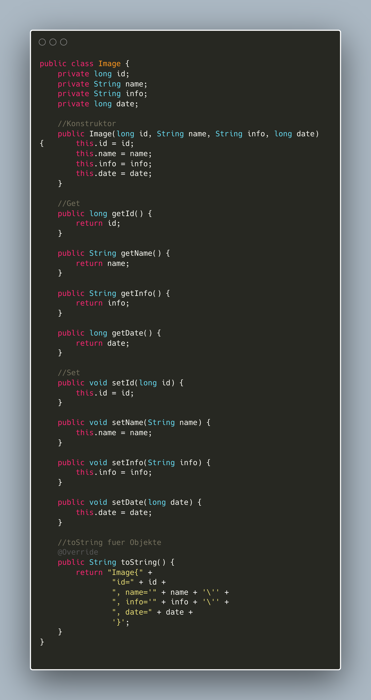
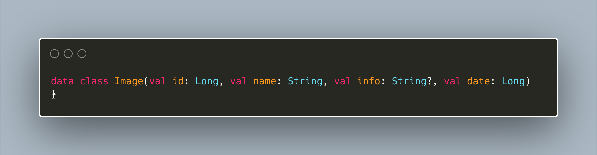

# Java vs Kotlin
**Web-Applikation My-Histo-App**  
**Datum:** 28.02.2025

## Warum Kotlin statt Java?
Kotlin bietet eine modernere Syntax, reduziert Boilerplate-Code und verbessert die Sicherheit durch null-sichere Typen. Im Vergleich zu Java benötigt Kotlin weniger Codezeilen, was die Lesbarkeit und Wartbarkeit erhöht. Weitere Informationen zu Kotlin findest man auf der offiziellen Website: [kotlinlang.org](https://kotlinlang.org/).

## Vergleich einer `Image`-Klasse in Java und Kotlin

Im Folgenden sehen wir eine einfache `Image`-Klasse, die in beiden Sprachen geschrieben wurde. Der Kotlin-Code ist deutlich kompakter.

> **Hinweis:**   Der gezeigte Code wurde automatisch generiert und dient lediglich der Veranschaulichung des Unterschieds zwischen Java und Kotlin. In realen Anwendungen können weitere Optimierungen und Anpassungen erforderlich sein.

