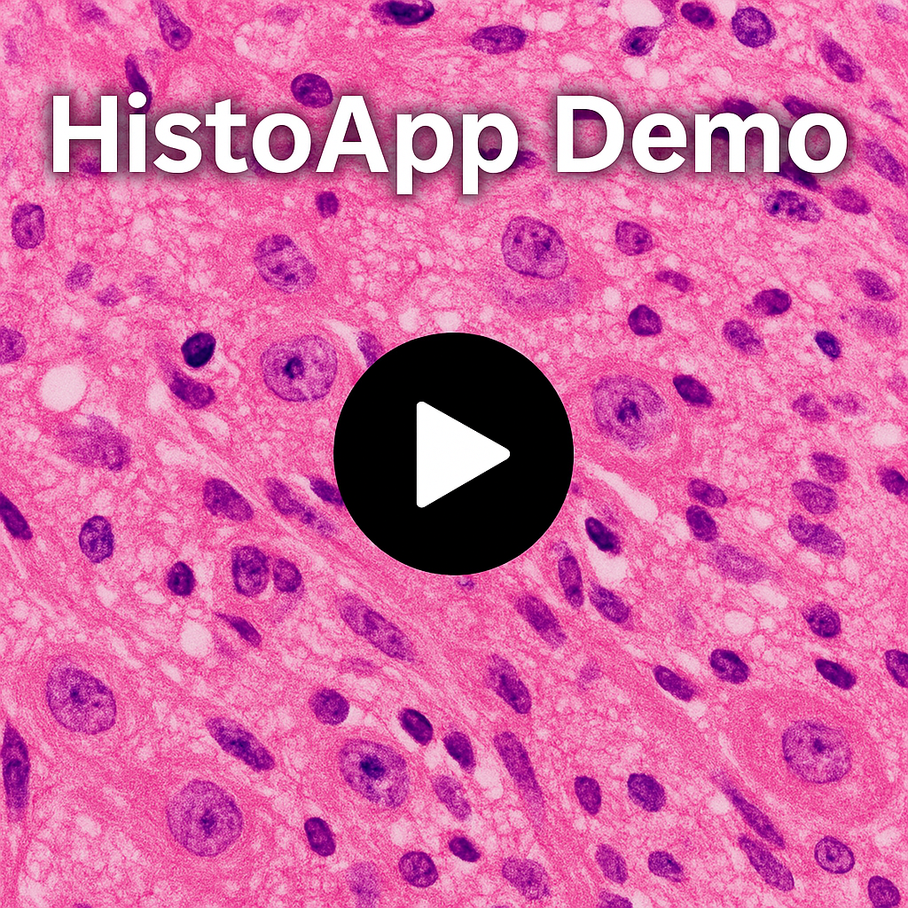

# 🧬 HistoApp – Webapplikation zur Verwaltung histologischer Gewebeproben

🎓 *Spitalprojekt im Studiengang Medizininformatik (B.Sc.) an der FHNW*

**HistoApp** ist eine webbasierte Anwendung zur Anzeige, Verwaltung, Annotation und Kommentierung von Bildern histologischer Gewebeproben.  
Sie wurde im Rahmen eines Hochschulprojekts entwickelt.

---

## 🔧 Tech Stack

- **Frontend:** React · TypeScript · Vite · Material UI · Axios · React Router  
→ Quellcode: [`/my-histo-app/frontend`](./my-histo-app/frontend)
- **Backend:** Spring Boot · Kotlin · RESTful API · Bruno (Test & Simulation)  
→ Quellcode: [`/my-histo-app/backend/histoapp`](./my-histo-app/backend/histoapp)
- **Datenbank:** H2 (Kommentare & Tags)  
- **Containerisierung & Server:**  [Docker Compose](./Dokumente_Lieferobjekte/Lieferobjekte/Server/Docker-compose.yml) · Apache (Reverse Proxy)  
→ Setup & Konfiguration: [`/Dokumente_Lieferobjekte/Lieferobjekte/Server`](./Dokumente_Lieferobjekte/Lieferobjekte/Server)
- **Monitoring:** Prometheus · Grafana

---

## 🧪 API-Tests mit Bruno

Für das Testen der REST-Schnittstellen wurde das Open-Source-Tool [Bruno](https://www.usebruno.com/) verwendet.  
Die Testfälle befinden sich im Ordner [`/histoappBruno`](./histoappBruno) und beinhalten u.a:

- `GETCOMMENTS.bru` – Abrufen von Kommentaren
- `DELETECOMMENTS.bru` – Löschen eines Kommentars
- `POSTTAGS.bru` – Erstellen neuer Tags
- Weitere Testcases für Tags, Filter und Instanzen

→  API-Test-Collection: [`/histoappBruno`](./histoappBruno)

---

## 📌 Features

- 🖼️ Anzeige & Verwaltung von Gewebebildern (DICOM-Integration über Orthanc)  
- 🏷️ Tagging- und Kommentarfunktion für einzelne Bildinstanzen  
- 🔌 REST-Schnittstellen zur Datenverwaltung  
- 📊 Monitoring der Systemleistung mit Prometheus & Grafana  
- 🐳 Containerisierte Entwicklungs- & Produktionsumgebung (Docker)

---
## 🎥 Demo-Video
Du möchtest sehen, wie HistoApp in Aktion aussieht? 
Dann klick hier und schau dir das kurze Demo-Video an:

  

> In diesem Video zeige ich die Funktionen der Anwendung:
> - Login via Keycloak
> - Bildanzeige & Navigation
> - Sprachwechsel zwischen Deutsch, Französisch und Englisch
> - Wechsel zwischen Light- und Darkmode 
> - Farbbasierte Filterung von Bildern
> - Detaillansicht mit Tagging & Kommentarfunktion
> - Filterung nach Tags, Beschreibungen und Kommentaren
> - Bilder-Download als ZIP-Archiv

*(Falls der Button/Thumbnail nicht funktioniert, klicken Sie hier: [🎥 Hier geht’s zum Demo-Video (Google Drive)](https://drive.google.com/file/d/1ck4kPS_QL9IJsGNLmrquxj2YifsK9PO0/view?usp=drive_link))*

---

## 📄 Dokumentation

Im Ordner [`/Dokumente_Lieferobjekte`](./Dokumente_Lieferobjekte) befinden sich weitere Unterlagen zum Projekt:

- Anforderungsdokumentation (Software Requirements Specification, Risikomanagement-Bericht)
- Architektur (System, Software)
- Server-Konfiguration & HTTPS Setup
- Projektstruktur, Meilensteine, Team-Notizen

---

## 🔄 DICOM-Konvertierung (Custom Converter)

Zur Integration von externen Bilddaten in das PACS-System wurde ein eigener **DICOM-Converter** entwickelt.  
Damit können z. B. `.jpg`-Dateien inklusive Metadaten in **valide DICOM-Dateien** umgewandelt werden, die anschliessend über Orthanc ins System geladen werden.

🗂️ Quellcode befindet sich im Ordner: [`/my-histo-app/dicomConverter`](./my-histo-app/backend/dicomConverter)

---
## 📄 Lizenz

Dieses Projekt wurde im Rahmen eines Hochschulprojekts an der FHNW erstellt und dient ausschliesslich zu Demonstrations- und Lernzwecken.

---